# AgriGuard Platform — Spatiotemporal Crop Pest and Disease Forecasting and Early Warning System

<p align="center">
  
  
  
  
</p>

<p align="center">
  <strong>AI-powered crop pest and disease forecasting and early warning system based on big data and artificial intelligence</strong>
  <br>
  <em>AgriGuard Platform: AI-Powered Crop Pest and Disease Forecasting & Early Warning System</em>
  <br>
  <em>TSPeakNet: Dual-scale time-series modeling for district-level crop-disease forecasting and peak-event warning</em>
  <br>
  <em>Yuanze Qin et al.</em>
</p>

---

## 📸 System Screenshots

### 🏠 Home Page — Function Navigation

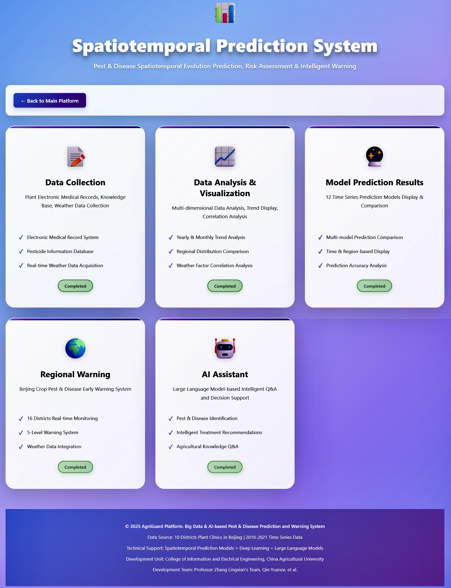

### 📊 Data Analysis — Multidimensional Visualization

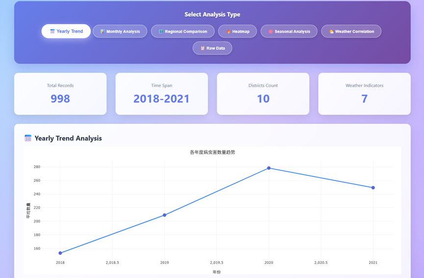

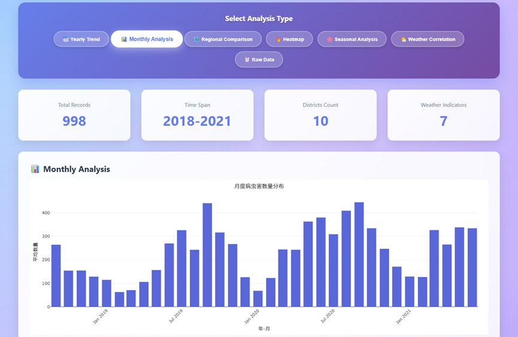

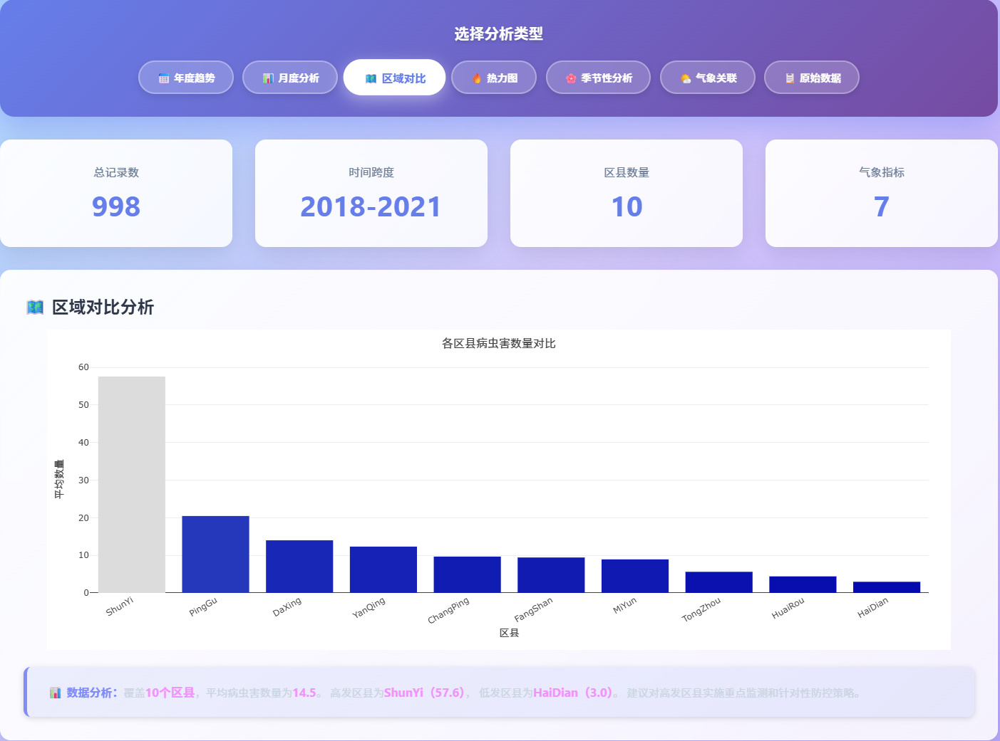

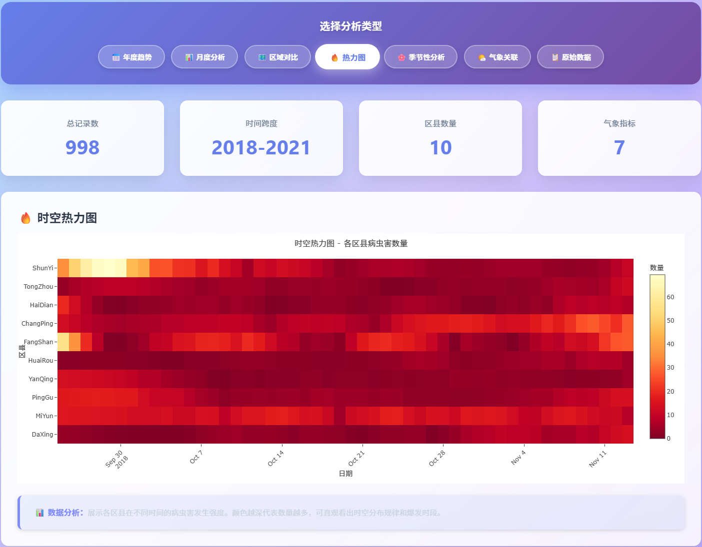

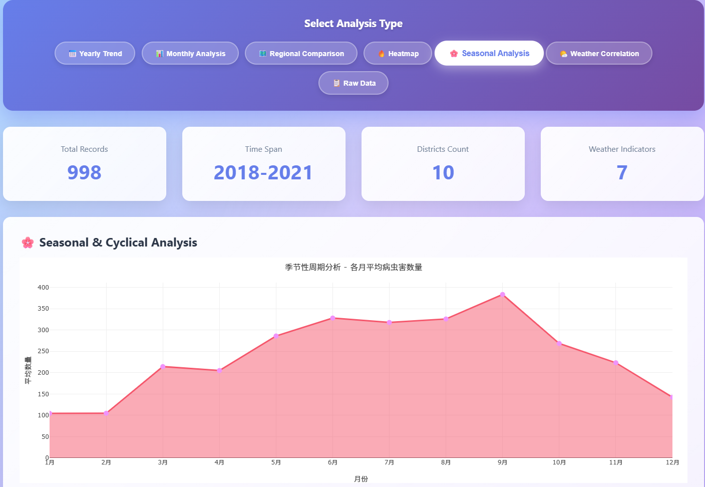

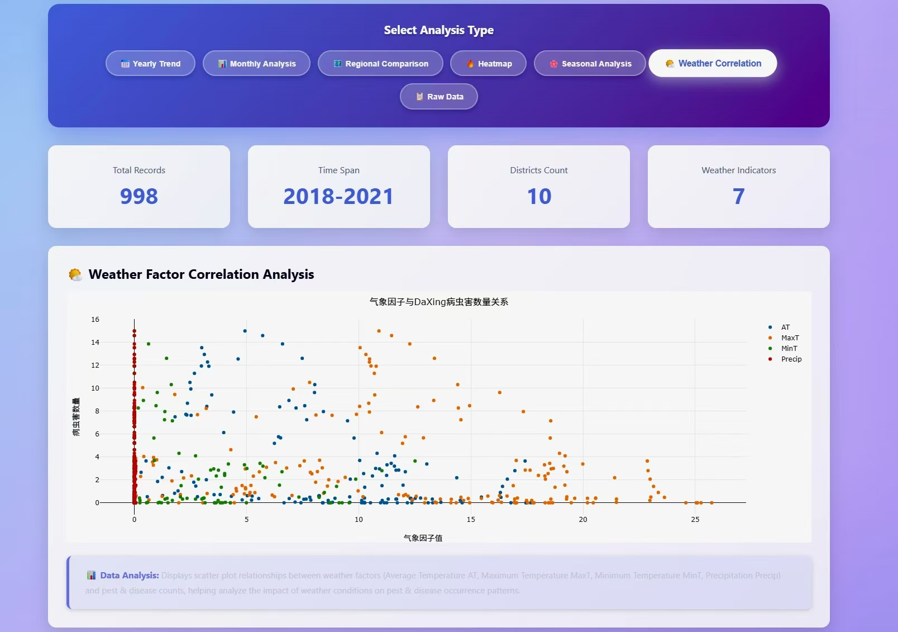

*Interactive charts for annual, monthly, regional, and multidimensional statistical analysis.*

### 🔮 Model Prediction — Comparison of 12 AI Models

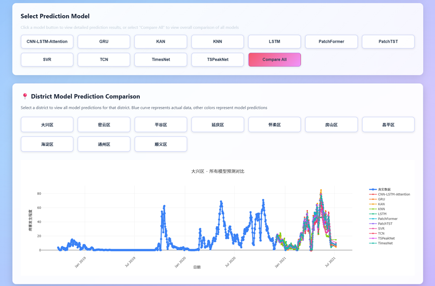

*The platform integrates 12 deep-learning models, including TSPeakNet, LSTM, GRU, and related baselines.*

### 🗺️ Regional Warning — Real-time Risk Map

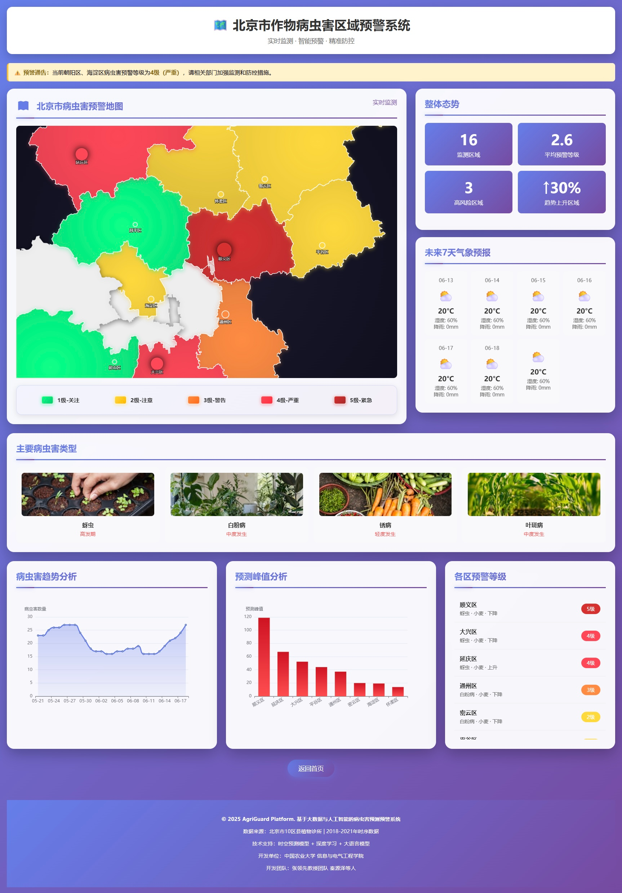

*District-level early warning map for Beijing, with color-coded risk levels.*

### 🌐 English Interface — Internationalization Support

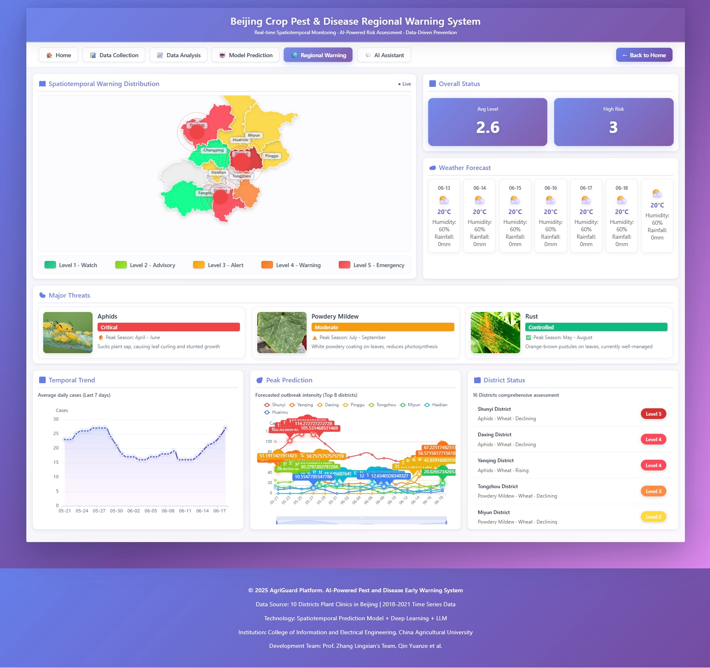

### 🦠 Disease Details — Professional Knowledge Base

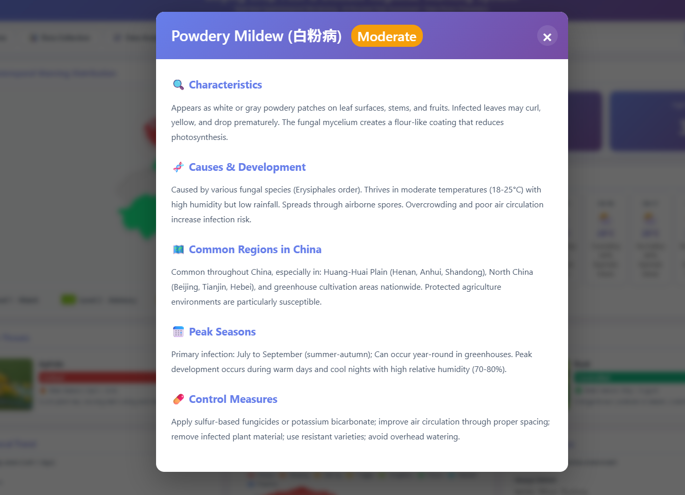

*Users can click a disease card to view detailed information on disease characteristics, occurrence patterns, and control measures.*

### 📝 Data Collection — PEMR Entry

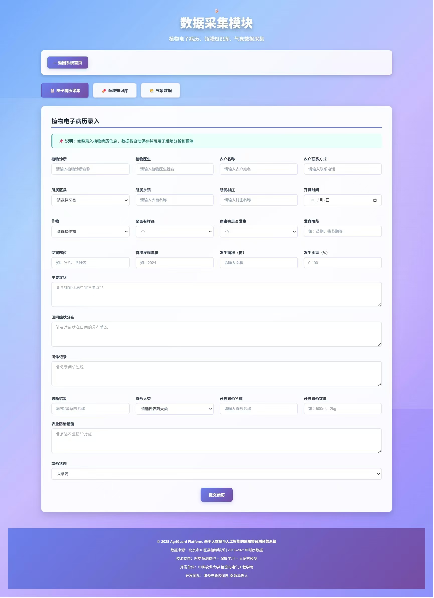

*Data-entry interface for plant medical records and meteorological information, supporting multi-field forms.*

---

## 🌟 Key Features

- 🌾 **Multidimensional data analysis** — Integrates multiyear time-series data and supports annual, monthly, regional, and multidimensional statistical analysis.
- 🔮 **Intelligent forecasting models** — Integrates 12 deep-learning models, including TSPeakNet, LSTM, GRU, and Transformer-based models.
- 🗺️ **Regional early-warning visualization** — Provides real-time district-level risk maps and early-warning information.
- 📊 **Interactive charts** — Uses ECharts and Plotly to provide dynamic and interactive data visualization.
- 🌐 **Multilingual support** — Provides Chinese and English interfaces for international use.
- 🎯 **Event-level evaluation** — Supports peak detection, temporal matching, and early-warning lead-time calculation.

---

## 🏗️ Technical Architecture

```text
┌─────────────────────────────────────────────────────┐
│                 Front-end Presentation Layer         │
│   ECharts 5.x | Plotly.js | HTML5 | CSS3 | ES6+     │
└─────────────────────┬───────────────────────────────┘
                      │
┌─────────────────────┴───────────────────────────────┐
│                 Business Logic Layer                 │
│   Python 3.8+ | HTTP Server | Data Processing        │
└─────────────────────┬───────────────────────────────┘
                      │
┌─────────────────────┴───────────────────────────────┐
│                 AI Modeling Layer                    │
│   TSPeakNet | LSTM | GRU | Transformer | 12 Models   │
└─────────────────────┬───────────────────────────────┘
                      │
┌─────────────────────┴───────────────────────────────┐
│                 Data Layer                           │
│   Excel (openpyxl) | Time Series | GeoJSON           │
└─────────────────────────────────────────────────────┘
```

**Technology stack**

- **Back end**: Python 3.8+, openpyxl
- **Front end**: HTML5, CSS3, JavaScript (ES6+)
- **Visualization**: ECharts 5.x, Plotly.js
- **AI models**: Spatiotemporal forecasting models and deep-learning models

---

## 📊 Data Sources

- **Data source**: Plant Electronic Medical Records (PEMRs) from plant clinics in 10 districts of Beijing
- **Time span**: Continuous time-series data from 2018 to 2021
- **Spatial coverage**: Daxing, Miyun, Pinggu, Yanqing, Huairou, Fangshan, Changping, Haidian, Tongzhou, and Shunyi districts
- **Data scale**: Pest and disease monitoring records covering 4 years × 10 districts × 365 days

---

## ⚡ Quick Start

### Installation and Launch

```bash
# 1. Install dependencies
pip install openpyxl

# 2. Start the server
python prediction_server.py

# 3. Open the system in a browser
# http://localhost:8003
```

### Main Pages

| Page | URL | Function |
|---|---|---|
| 🏠 Home | `/` | System navigation and overview |
| 📝 Data Collection | `/data-collection` | Entry of plant medical records and meteorological data |
| 📊 Data Analysis | `/data-analysis` | Multidimensional statistical analysis and visualization |
| 🔮 Model Prediction | `/model-prediction` | Prediction comparison across 12 models |
| 🗺️ Regional Warning | `/regional-warning` | Real-time regional risk map (Chinese version) |
| 🌐 English Warning | `/regional-warning-en` | Risk map (English version) |

---

## 🎯 System Highlights

### 1. District-level Model Comparison

The system visualizes the prediction performance of 12 deep-learning models for individual districts, enabling intuitive comparison between observed and predicted values.

- **Technical innovation**: Automatically converts wide-format data and supports district-level selection.
- **Visualization**: Provides interactive line charts based on Plotly.js, including zooming and hover-based inspection.
- **Practical value**: Helps identify suitable models for precise district-level forecasting.

### 2. Real-time Early-warning Map

The Beijing district-level risk map is driven by ECharts and provides color-coded risk visualization.

- **Five warning levels**: Risk levels range from normal (green) to emergency (dark red).
- **Real-time update**: Risk levels are dynamically calculated using model predictions.
- **Interactive experience**: Users can hover for details and click to view historical trends.

### 3. Intelligent Disease Knowledge Base

Users can click disease cards to open structured plant-protection knowledge.

- **Rich content**: Includes symptoms, causes, affected regions, seasons, and control measures.
- **AI-assisted content**: Provides plant-protection knowledge generated or organized with AI assistance.
- **User-friendly interface**: Uses clean modal windows with clear information categories.

---

## Project Structure

```text
spatiotemporal_prediction_system/
├── prediction_server.py          # Main server file
├── simple_data_reader.py         # Data reading module
├── data_analyzer.py              # Data analysis module
├── data_collector.py             # Data collection module
├── model_prediction_page.html    # Model prediction page
├── requirements.txt              # Python dependencies
├── README.md                     # Project documentation
├── 时序数据/                     # Data directory
│   ├── 原始数据.xlsx
│   ├── LSTM-预测数据.xlsx
│   ├── GRU-预测数据.xlsx
│   ├── TSPeakNet-预测模型.xlsx
│   ├── ... (other model prediction files)
│   └── 北京.json                 # Map data
└── static/                       # Static assets
```

---

## Data Preparation

**Raw data format** (`原始数据.xlsx`):

```text
Date        | Node_DaXing | Node_MiYun | Node_PingGu | ...
2018-09-25  | 3.65        | 15.71      | 16.32       | ...
2018-09-26  | 4.23        | 14.88      | 17.45       | ...
```

**Prediction data format** (`LSTM-预测数据.xlsx`):

```text
Date        | Node_DaXing | Node_MiYun | Node_PingGu | ...
2021-01-01  | 2.34        | 12.45      | 15.67       | ...
2021-01-02  | 2.56        | 13.21      | 16.23       | ...
```

---

## Technical Details

### Model Prediction Workflow

```text
Historical time-series data
        ↓
Feature engineering
        ↓
Deep-learning models (12 models)
        ↓
Prediction generation
        ↓
Performance evaluation (MAE/RMSE/R²)
        ↓
Visual comparison
```

### Early-warning Generation Logic

```text
Real-time data collection
        ↓
Spatiotemporal forecasting model
        ↓
Risk-level assessment
        ↓
Threshold-based decision
        ↓
Early-warning generation
        ↓
Map-based visualization
```

---

## Copyright and Citation

### Copyright

© 2025 AgriGuard Platform. AI-powered crop pest and disease forecasting and early warning system based on big data and artificial intelligence.

**Data source**: Plant clinics in 10 districts of Beijing | Prescription data from 2018 to 2021  
**Technical support**: Spatiotemporal forecasting models + deep learning + large language models  
**Developer affiliation**: College of Information and Electrical Engineering, China Agricultural University  
**Development team**: Prof. Lingxian Zhang's team, including Yuanze Qin and collaborators

### Academic Citation

If you use this system or related methods, please cite the following work:

```bibtex
@article{qin2025tspeaknet,
  title={TSPeakNet: Dual-scale time-series modeling for district-level crop-disease forecasting and peak-event warning},
  author={Qin, Yuanze and Han, Zonghuan and Zhang, Lingxian and Zhang, Yiding},
  year={2025}
}
```

### License

This project is released under the [MIT License / Apache 2.0] open-source license.

---

## Contact

- **Technical support**: zhanglx@cau.edu.cn; qinyuanze@cau.edu.cn
- **Project homepage**: [GitHub Repository](https://github.com/qyz1998453X/TSPeakNet.git)
